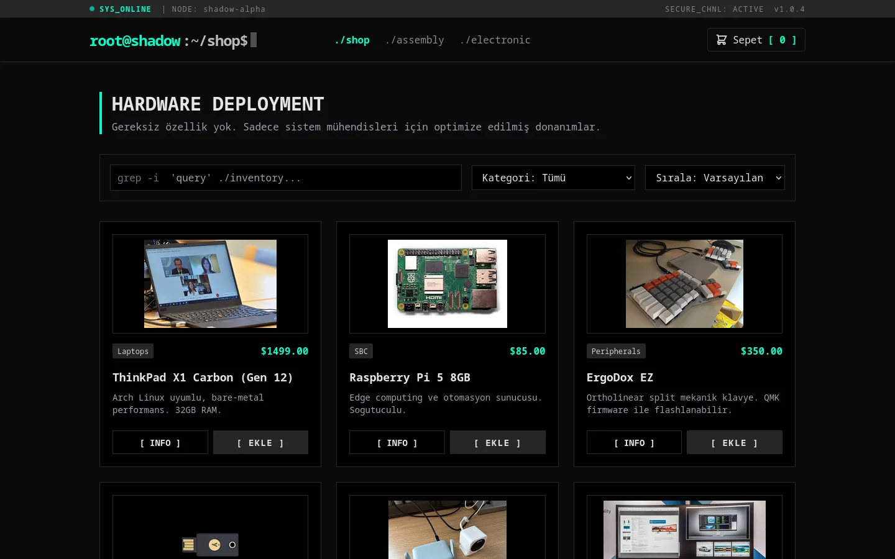
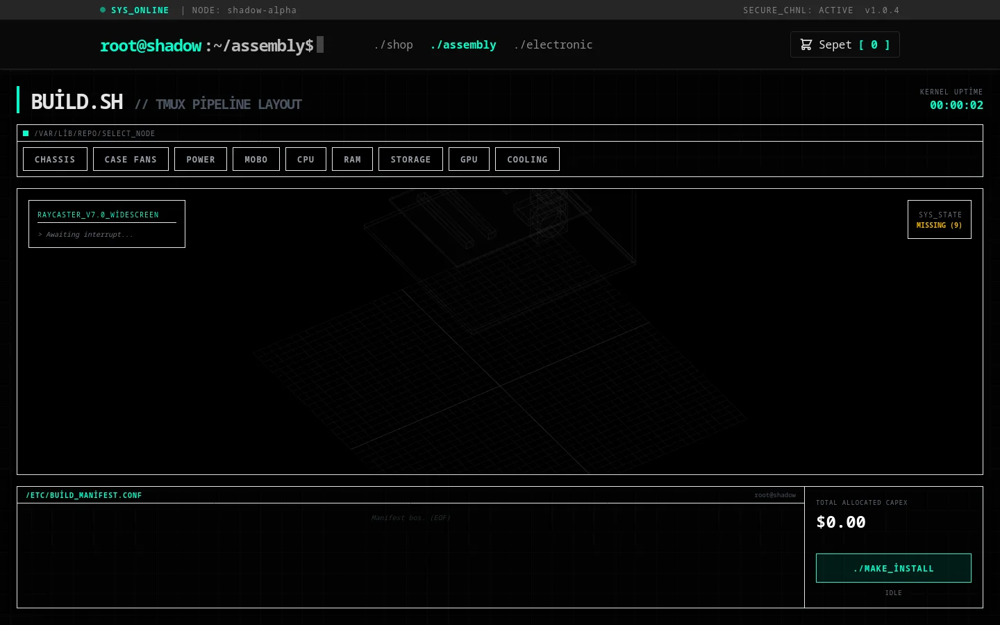
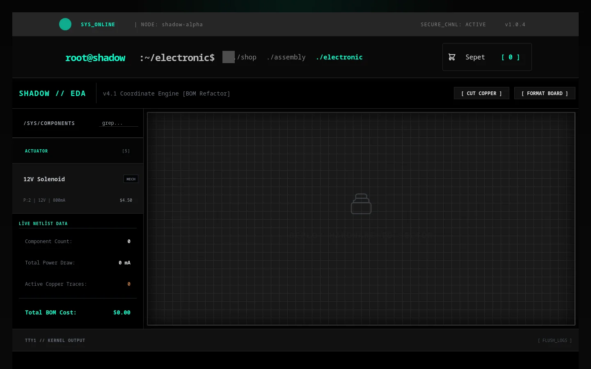
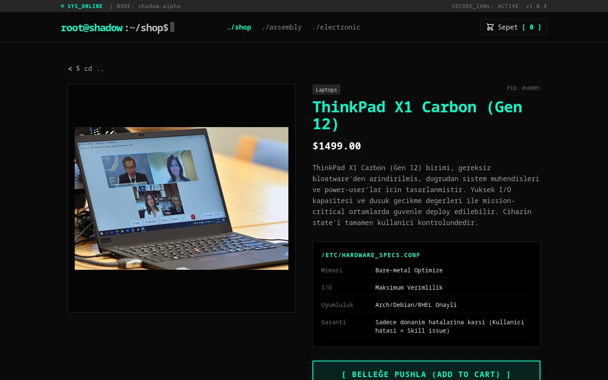
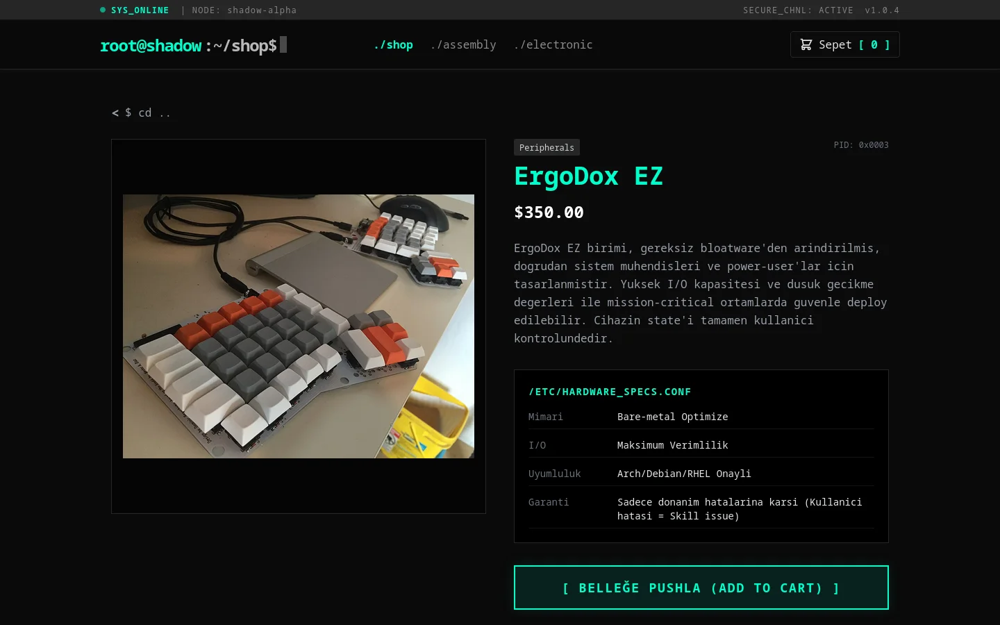
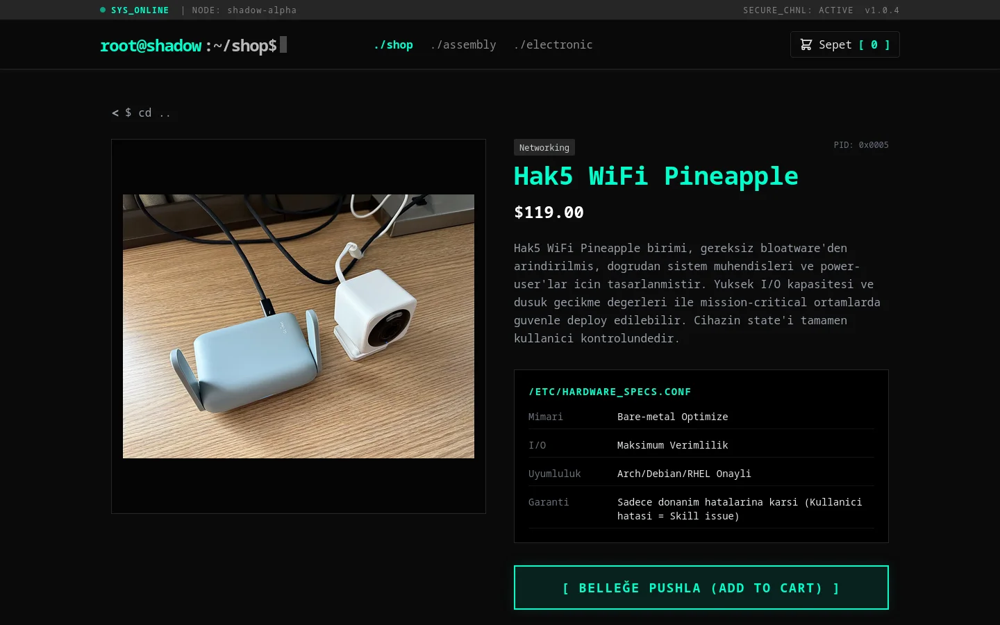
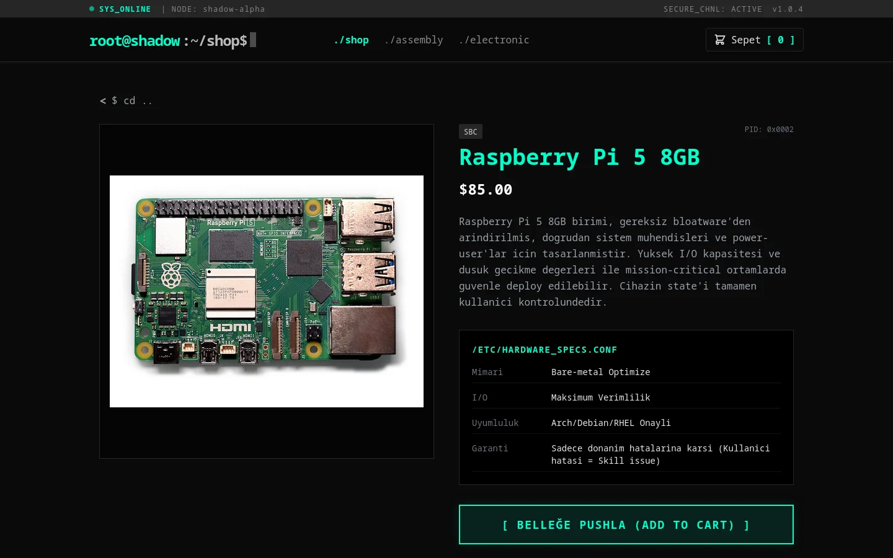
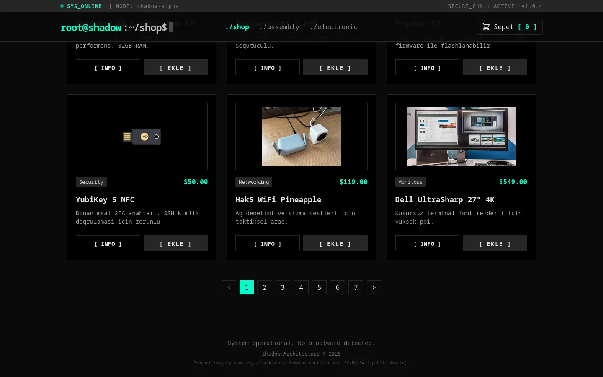

<div align="center">


# SHADOW // Hardware Terminal

**Terminal estetiğinde modüler donanım katalog demosu** — Qwik 1.19 (çıplak, Qwik City'siz) + Three.js + Tailwind. Shop, Assembly ve Electronic yüzeylerini tek browser-only SPA içinde resumable rendering ile sunar.

[](#tech-stack)
[](https://lavescar.com.tr)
[](#license)

[**▸ Live demo**](https://lavescar.com.tr) · [**▸ Portfolyo**](https://lavescar.com.tr) · [**▸ Diğer demolar**](https://lavescar.com.tr/#projects)

</div>

---

<p align="center"></p>

## Genel bakış

SHADOW, "alışveriş arayüzü ne kadar oyun gibi gösterilebilir" sorusuna cevap arayan deneysel bir storefront demosudur. Üç ayrı çalışma yüzeyi tek SPA içinde shell paylaşır:

- **Shop** — temel donanım katalog, sepet, ürün detay
- **Assembly** — modüler montaj akışı, parça uyumluluğu, çizim/şema
- **Electronic** — EDA-stil devre yüzeyi, pin haritası, simülasyon placeholder

Qwik City değil çıplak Qwik kullanılır — view ve section state'i app-context içinde manuel yönetilir. Three.js sahneleri sayfa düzeyinde lazy yüklenir; ana shell sıfır 3D bağımlılığı ile çalışabilir.

## Tech stack

| Layer | Technology |
|---|---|
| Framework | Qwik 1.19 (çıplak, Qwik City değil) |
| 3D / grafik | Three.js 0.128 |
| Styling | Tailwind CSS 3.4 |
| Build | Vite 7 + TypeScript 5.8 |
| State | `src/context/app-context.ts` (global context) |
| Data | Mock — `src/data/*` |
| Deploy | Cloudflare Pages (statik) |

## Ekran görüntüleri

<table>
  <tr>
    <td></td>
    <td></td>
  </tr>
  <tr>
    <td></td>
    <td></td>
  </tr>
  <tr>
    <td></td>
    <td></td>
  </tr>
  <tr>
    <td colspan="2"></td>
  </tr>
</table>

## Hızlı başlangıç

```bash
git clone https://github.com/Lavescar-dev/shadow-qwik-app.git
cd shadow-qwik-app

npm install
npm run dev          # → http://localhost:5173
npm run build        # → dist/
npm run check        # tsc --noEmit
```

## Yapı

```
shadow-qwik-app/
├── src/
│   ├── root.tsx                 # Uygulama kabuğu, view + section switching
│   ├── entry.dev.tsx            # Dev modu render entrypoint
│   ├── context/
│   │   └── app-context.ts       # Global state context
│   ├── components/
│   │   ├── (header, footer, catalog, cart, detail, checkout, toasts, pagination)
│   │   ├── assembly/            # Montaj yüzeyi
│   │   └── electronics/         # Devre/EDA yüzeyi
│   ├── data/                    # Mock ürün, envanter, yorumlar
│   └── lib/                     # actions, cart, catalog, format, electronics, assembly
└── docs/                        # README hero + screenshots
```

## Deploy

Cloudflare Pages için doğrudan repo bağlanır:

| Field | Value |
|---|---|
| Build command | `npm install && npm run build` |
| Build output directory | `dist` |
| Node version | `20` |

## License

MIT © 2026 Lavescar

---

<sub>Built by **[Lavescar](https://lavescar.com.tr)** · [Portfolyo](https://lavescar.com.tr/#projects) · [efe@lavescar.com.tr](mailto:efe@lavescar.com.tr)</sub>
